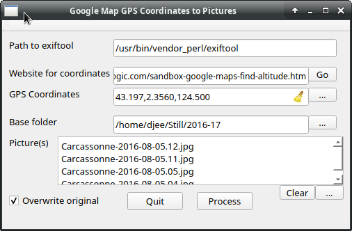

# GoogleMapCoordinatesToExiftool

**Qt GUI**: take geotags from sites such as Google Maps and injects into pictures with `Exiftool`

Understands coordinates in decimal (negative for south and west) or sexagesimal (° ' "), longitude first, latitude second

Optionally, altitude (in meters) can be given as a third parameter

Can select multiple photos

Main purpose is to avoid typing long command lines invoking `ExifTool`

Typical invocation of `Exiftool`:

`exiftool -m -GPSLatitude=47.361742030311525 -GPSLatitudeRef=N -GPSLongitude=0.675988018529097 -GPSLongitudeRef=E -GPSAltitude=60.000 -GPSAltitudeRef=above -overwrite_original pic1.jpg pic2.jpg`

It also possible to extract GPS coordinates from a photo with a button next GPS Coordinates text area and copy result to this area

